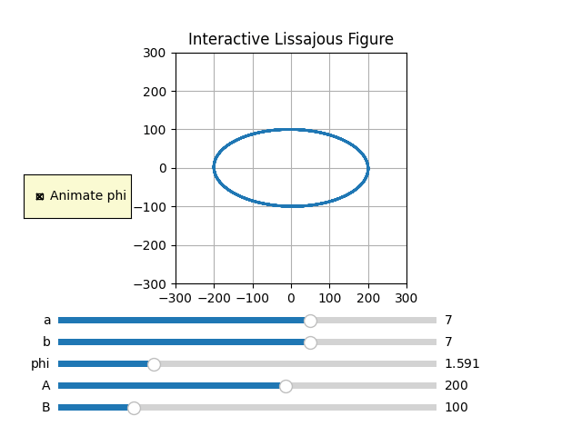

# Lissajous Figure Visualizer

<p float="left">
  
   
</p>


## Overview
This Python script leverages Matplotlib to generate interactive visualizations of Lissajous figures, which are the result of parametric equations that describe complex harmonic motion. The interface includes sliders to dynamically adjust the parameters and a checkbox to animate the phase change.

## Features
- **Interactive Control**: Adjust the frequencies (`a`, `b`), phase (`phi`), and amplitudes (`A`, `B`) using sliders.
- **Animation Control**: Toggle the animation of the phase (`phi`) using a checkbox.
- **Real-Time Visualization**: Observe changes in the visualization as you manipulate the controls.

## Installation

### Prerequisites
- Python 3.x
- Matplotlib
- Numpy

```bash
pip install -r requirements.txt
```